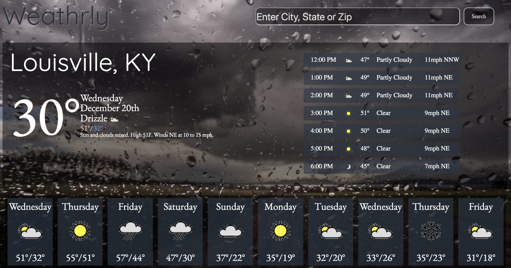

# Weathrly

View it live [here](http://weathrly-pm.surge.sh/)

## Description

Weathrly is a weather app built on the ReactJs framework. The motivation behind the layout was to present a user up to date weather info for any location they choose. We took forecast info for the curernt hour, the seven hour forecast, and the ten day forecast and overlayed it on vivid, high resolution images tied to the current condition to give the user a more visceral feel for the current weather conditions. 

Weathrly uses the Weather Underground API to retrieve current weather conditions and presents it to the user on a React based app. The app will take new users to a welcome screen where they can enter in their location, or if they are a returning user the app will take the user to their last searched location. The search bar makes use of a prefix-trie to give the user auto-complete functionality, and the auto-complete is pre-populated with a list of 1000 cities. 

To download this app, just clone down this repo and retrieve a developer key for the Weather Undergroudn API. The key must be in a file lib/key.js and named to a variable key and exported.  

### Static Site Layout

### Installation

You must have `npm` installed on your machine

Clone down this repository

To install:
`npm install`

To start: 
`npm start`

To test:
`npm test`
